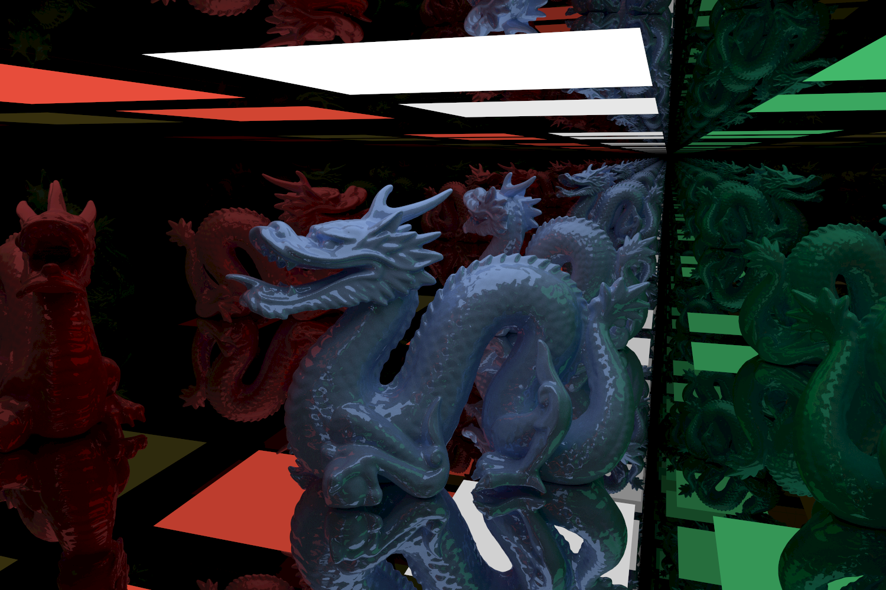

# Vulkan Ray Tracer

A ray tracing–focused abstraction layer for Vulkan, implemented in C++ using Vulkan-Hpp using modern ray tracing hardware.
This project was developed as part of my bachelor's thesis and aims to simplify the development of GPU ray tracing applications while still exposing the flexibility and performance of Vulkan.

The library reduces much of the boilerplate required by Vulkan and provides a structured framework for building modern GPU ray tracing applications.



*This example scene consists of over 850'000 triangles and is rendered in real-time at a resolution of 1500×1000. The image was recorded in under one second of accumulation. Model source: [Stanford 3D Scanning Repository](http://graphics.stanford.edu/data/3Dscanrep/).*

## Overview

Low-level graphics APIs such as Vulkan offer extremely powerful features but require substantial setup and boilerplate code. This project introduces an abstraction layer that simplifies common tasks such as:

- resource creation
- memory management
- synchronization
- ray tracing pipeline setup

Despite this abstraction, the system remains lightweight and close to the underlying API. For example, rendering a triangle using the framework requires roughly 60 lines of C++ code.

## Project Structure

This project contains the following folders/files:

- __engine/__ - The main source code of this project, framework and Vulkan abstraction.
- __raytracer/src/main.cpp__ - The main entry point of the project, where a new ray tracer can be implemented.
- __raytracer/src/examples/__ - Contains the path tracing example.
- __raytracer/src/tutorial/__ - Contains all seven incremental projects of the tutorial, each in a separate file.
- __raytracer/src/tutorial/__ - Contains all seven incremental projects of the tutorial, each in a separate file.
- __shaders/examples/__ - The shader for the path tracing example.
- __shaders/tutorial/__ - The shader for the tutorials.
- __assets/__ - Base folder of external ray tracing assets, e.g. images or scene descriptions.
- __docs/__ - Additional documentation, e.g. the tutorial.

## Example

This repository contains a comprehensive path tracing example that covers the following topics:

- Physically based path tracing
- Multiple light bounces (recursion)
- Support for the following material types:
  - Diffuse
  - Emissive
  - Reflective
  - Specular
  - Refractive / Glass
- glTF scene loading
- WASD camera movement

### Running the example

You can find detailed explanations on the required dependencies in the first section of the tutorial in __docs/tutorial.pdf__.

To run the example, build the project as instructed in the tutorial, then run:

```
./raytracer/pathtracer
```

## Tutorial

A tutorial with seven incremental projects can be found in __docs/tutorial.pdf__. Source code for all tutorial is available in __raytracer/src/tutorial/__.

## Shader Support

Shaders are written in Slang, which provides a modern shader development workflow and improves modularity.

## Educational Context

This project was developed as part of a bachelor's thesis in computer science / computer graphics.
Its goal is to explore the design of a reusable abstraction layer for Vulkan ray tracing applications while demonstrating its effectiveness through tutorials and a full rendering example.

## License

This project is licensed under the Apache License 2.0. See the LICENSE file for details.
